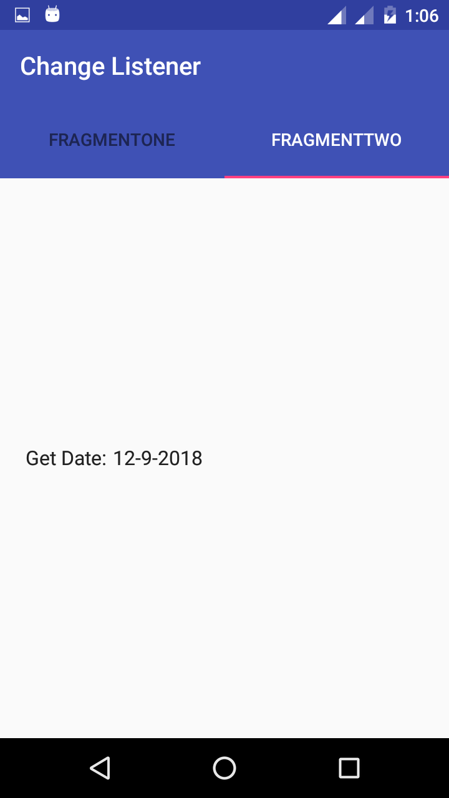

# Change Listener Variable Example(Android Jetpack architecture component)

Observe variable changes from one fragment to another fragment using Android Jetpack architecture component or you can also say Architecture Component both are same.

### This Example also shows that:-

1) How to set variable changes Listener from one fragment to another fragment.
2) How to set variable changes Listener from one fragment to another fragment using LiveData or Architecture component or Android Jetpack architecture component.
3) How to keep watch on variable changes from one fragment to another fragment.
4) How to Observe variable changes in tablayout.
5) How to set observer on variable.
6) How to Share data between fragments using LiveData or Architecture component or Android Jetpack architecture component in lifecycle consists way.

### Note:-

You can also Observe variable changes in two or more fragments.

### Reference:- 

1) https://developer.android.com/topic/libraries/architecture/viewmodel#sharing
2) https://stackoverflow.com/questions/44272914/sharing-data-between-fragments-using-new-architecture-component-viewmodel

## Screenshots:-

 

 

